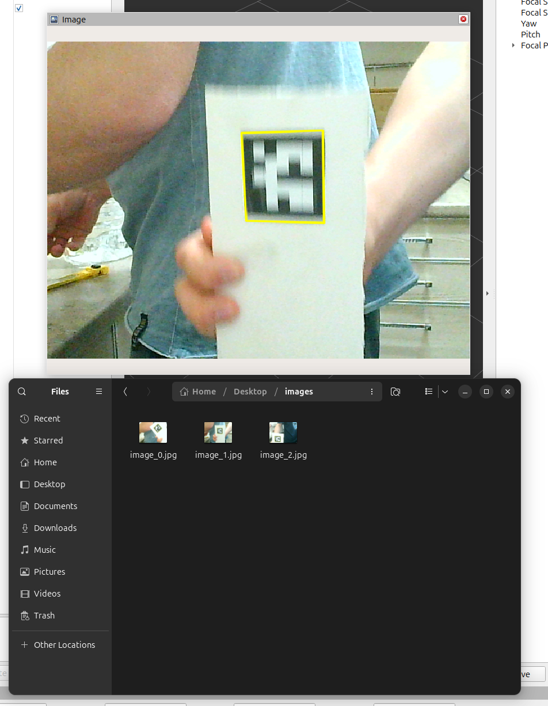

<div align="center" style="text-align: center;">
  
# ROS2 image saver
</div>
This is a simple ros2 node that allows you to save every frame sent to the ros topic. This can be useful in saving logs, program execution results, and other things.

---

## Installation
### Prerequirements

- ROS2 Rolling (or your desired ROS2 distribution)
- A topic with data to save (sensor_msgs/msg/Image)

### Setting Up the Node

1. Clone this repository to your ROS2 workspace:
```bash
cd ~/ros2_ws/src
git clone https://github.com/dark516/ros2_image_saver
```
2. Build the package:
```bash
cd ~/ros2_ws
colcon build --packages-select ros2_image_saver
```
3. Source the workspace:
```bash
source ~/ros2_ws/install/setup.bash
```

## Running the Node

1.  Run the node with an explicit indication of the port received in the previous step
```bash
ros2 run ros2_image_saver_pkg image_saver --dir /path/to/save/images (default: images)
```
And now every frame sent to the topic will be saved to the specified directory


